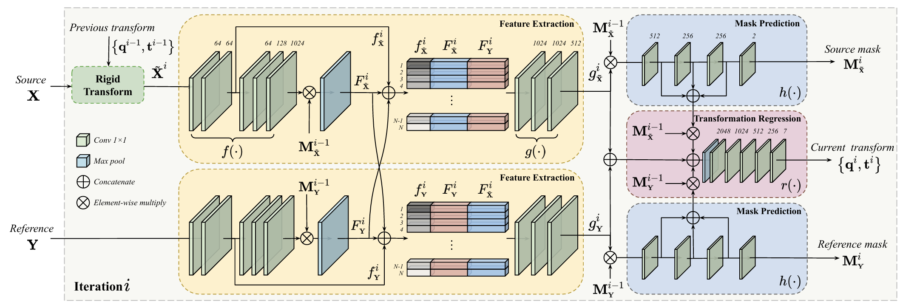
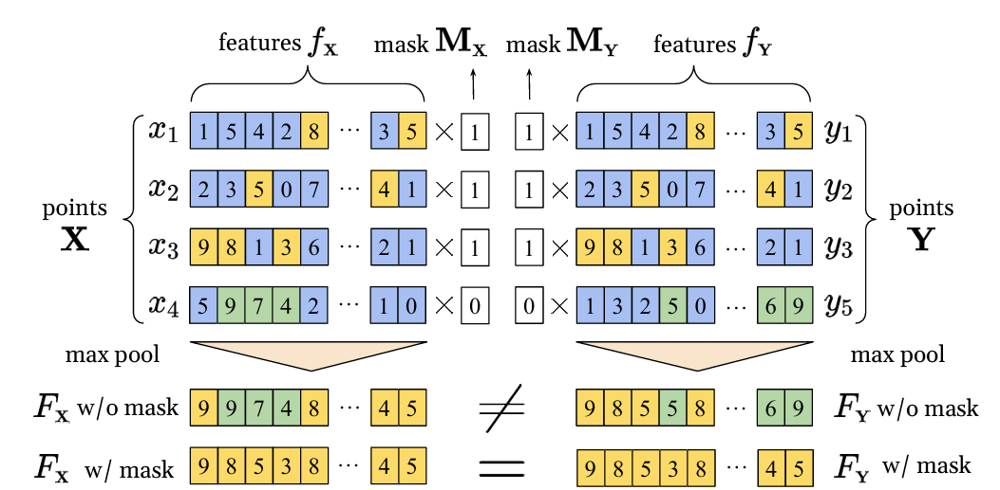

## Paper Reading

论文阅读：OMNet: Learning Overlapping Mask for Partial-to-Partial Point Cloud Registration

Project page:[https://openaccess.thecvf.com/content/ICCV2021/papers/Xu_OMNet_Learning_Overlapping_Mask_for_Partial-to-Partial_Point_Cloud_Registration_ICCV_2021_paper.pdf](https://openaccess.thecvf.com/content/ICCV2021/papers/Xu_OMNet_Learning_Overlapping_Mask_for_Partial-to-Partial_Point_Cloud_Registration_ICCV_2021_paper.pdf)

## Pipeline

1. 局部特征 + 全局特征 -> 通过学习与训练，可以用这个网络提取local和global features，然后计算出重叠区域和[q, t]
2. loss为重叠度 + 与训练集gt真值的差值

## 神经网络的设计

1. 通过f提取出该点云每个点的特征 → 每个点云通过Mask加入到全局点云的特征中去 → 得到全局点云特征 F
2. 在第一步中每个点云的特征f + 算出来的全局点云特征F，拼起来 → 通过g提取特征后(这时候有局部f和两个点云的全局X，Y) → 再用Mask过一遍 → 最后用h提取特征，作为新的Mask。
3. 第二步中，计算出的g特征提取的两个点云的特征 + 第二步中两个点算出的新的Mask_i * 前一轮次的 Mask_(i-1) → 通过r输出旋转矩阵

学习每个点云中每个点的特征，作为计算重叠度和全局特征的基本单位与组成

## 注记

有意思的是，居然在未见过的场景类别中，也能够有效地进行pcd registeration。说明OMNet能够有效提取识别出局部和全局特征。计算出该轮次的R和T，再到下一轮中投入使用，输出更准确的。

> This is my github link: [Source](https://github.com/Kairui-SHI)