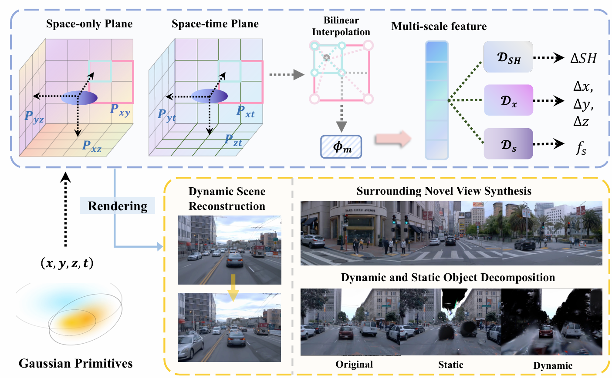
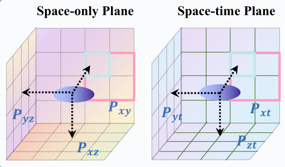

## Paper Reading

论文阅读：$S^3$Gaussian: Self-Supervised Street Gaussians for Autonomous Driving

Project page:[https://wzzheng.net/S3Gaussian/](https://wzzheng.net/S3Gaussian/)

## Pipeline

1. 四维高斯场表三维时序场
2. 两层mlp(对应两个体素场)学习语义特征，无监督学习分割时序物体，并记为体素特征
3. 渲染体素场，通过体渲染公式训练3DGS和mlp

## 高斯场的升级：3D→4D  

从spatial到temporal-spatial:把高斯基元(Gaussian Primitive)四个位置特征(x,y,z,t)，分别放在两个voxel grid里面，spatial(xy,xz,yz平面)和temporal(xt,yt,zt平面)。

像instant-ngp一样，每个voxel grid上的顶点，有d维的特征信息。将xyzt输入通过两个mlp可以得到这个voxel grid每个vertex上的特征。

## 无监督语义特征学习

通过不同的解码器(Decoder)对特征进行解码，解码特征f_s 作为 semantic feature判断的标准。并结合3DGS必要的特征(位置、颜色、透明度等)，以及语义特征，渲染出图像与gt计算。那么在训练3DGS的时候就会把mlp的参数也给训练了。达到了识别静物动物的效果。

$$
\begin{equation}
G' = \{X + \Delta X, C + \Delta C, s, r, \sigma, f_s\}
\end{equation}
$$

## 注记

Loss：

1. loss_rgb：渲染RGB与gt差值；
2. loss_ssim：图像之间的相似性；
3. loss_depth：深度差值；
4. loss_feat：语义分割的特征差值

loss_rgb和loss_ssim一起用确实不错，更合理

> This is my github link: [Source](https://github.com/Kairui-SHI)
>
> 参考文献：[Huang, Nan, Xiaobao Wei, Wenzhao Zheng, Pengju An, Ming Lu, Wei Zhan, Masayoshi Tomizuka, Kurt Keutzer and Shanghang Zhang. “$\textit{S}^3$Gaussian: Self-Supervised Street Gaussians for Autonomous Driving.” (2024).](https://arxiv.org/html/2405.20323v1#bib)
